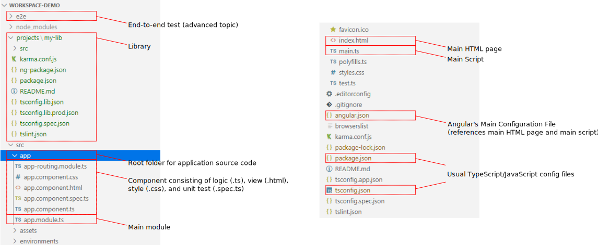
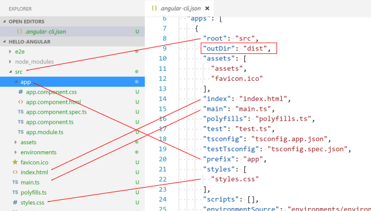
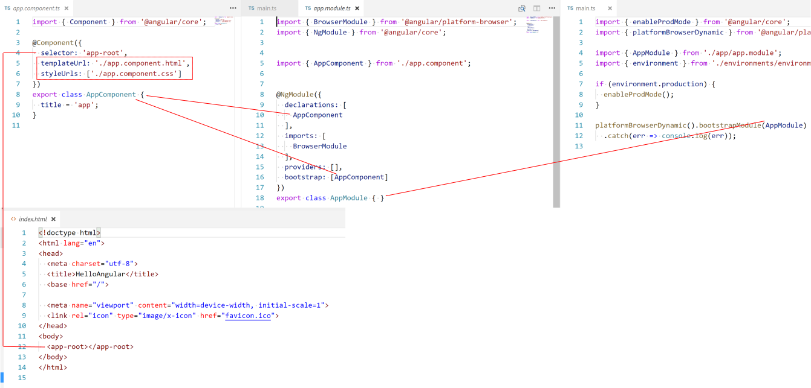

# Angular

Introduction to [Angular CLI](https://cli.angular.io/)


<!-- .slide: class="left" -->
## What is *Angular*?

* Platform for building client applications with web technology
  * HTML, JavaScript/TypeScript, CSS/SASS
* Angular covers ([read more details](https://angular.io/guide/architecture)):
  * Modules
  * Components (=application logic)
  * Templates (=view)
  * Data Binding (*Components* to *Templates*)
  * Services
  * Dependency Injection


<!-- .slide: class="left" -->
## Getting Started

* [Angular CLI](https://cli.angular.io/)
* Dry run
  * Runs through the CLI command and reports activity without writing out results
  * Safe trying out while you are learning

```
npm install -g @angular/cli
ng help
ng new my-first-project
cd my-first-project
ng serve
```


<!-- .slide: class="left" -->
## *ESLint*

* Previous to Angular 12: *TSLint*
* Since Angular 12, no default linter
  * *ESLint* recommended
* Recommendation: Add [*angular-eslint*](https://github.com/angular-eslint/angular-eslint) to your project


<!-- .slide: class="left" -->
## Getting Started

* [StackBlitz](https://stackblitz.com/)
  * Online *Visual Studio Code* IDE for Angular (and much more)
  * [Read details...](https://medium.com/@ericsimons/stackblitz-online-vs-code-ide-for-angular-react-7d09348497f4)
* Consider for VSCode:
  * [*Nx Console* extension](https://marketplace.visualstudio.com/items?itemName=nrwl.angular-console)
  * [*Angular Essentials* extension](https://marketplace.visualstudio.com/items?itemName=johnpapa.angular-essentials)
  * [*Live Share* extension](https://marketplace.visualstudio.com/items?itemName=MS-vsliveshare.vsliveshare)
* Consider for Chrome: [*Angular DevTools*](https://chrome.google.com/webstore/detail/angular-devtools/ienfalfjdbdpebioblfackkekamfmbnh)


<!-- .slide: class="left" -->
## Important Commands (`ng help`)

| Command  | Description                                                                                                                               |
| -------- | ----------------------------------------------------------------------------------------------------------------------------------------- |
| build    | Compiles an Angular app into `dist/`.                                                  |
| e2e      | Builds app, then runs end-to-end tests ([*Protractor*](https://protractor.angular.io/)).                        |
| generate | Generates and/or modifies files based on a [*schematic*](https://angular.io/guide/schematics).                                            |
| lint     | Runs [linting tools](https://eslint.org/) on Angular app code.                                                  |
| new      | Creates a new workspace and an initial Angular app.                                                                                       |
| serve    | Builds and serves your app, rebuilding on file changes.                                                                                   |
| test     | Runs unit tests in a project.                                                                                                             |
| update   | Updates your application and its dependencies. See [https://update.angular.io/](https://update.angular.io/)                               |
| version  | Outputs Angular CLI version.                                                                                                              |


<!-- .slide: class="left" -->
## Workspaces and Apps

* A *workspace* can contain multiple apps and [libraries](https://angular.io/guide/libraries).
* Created with `ng new`
  * Create an initial app by default
  * Additionall apps/libraries are stored in `projects/`
* Configuration in [`angular.json` workspace config file](https://angular.io/guide/workspace-config)
  * [Schema](https://github.com/angular/angular-cli/wiki/angular-workspace)
  * Use `ng config` to configure


<!-- .slide: class="left" -->
## Project Structure




<!-- .slide: class="left" -->
## Libraries

* Unified user interface accross multiple Angular apps
  * Example: [*Angular Material*](https://material.angular.io/)
* Create general solutions for particular domains that can be re-used in different apps
* Installed using `npm install`
  * Tip: Use [`npm link`](https://docs.npmjs.com/cli/link) while working on library
* Angular [library creation guide](https://angular.io/guide/creating-libraries)


<!-- .slide: class="left" -->
## Project Structure




<!-- .slide: class="left" -->
## Project Structure




<!-- .slide: class="left" -->
## Building Angular Apps

* [`ng build`](https://angular.io/cli/build)
  * Add *project name* to build a certain project
  * `--prod` for production builds
  * `--watch` to run build if files change
* [Environment-specific settings](https://angular.io/guide/build#configuring-application-environments)
* Configure browser compatibility using [*Browserslist*](https://github.com/browserslist/browserslist)
  * To speed things up, use `last 1 Chrome version` in this training
* Template compilation
  * JIT vs. AoT
  * `ng serve/build --aot=false|true`
  * Try `ngc` and take a look at code 

